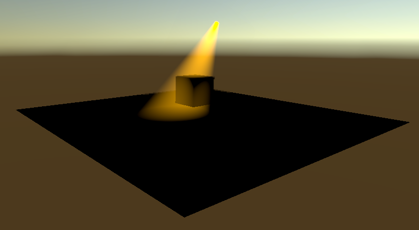

# Fake Volumetri Light

利用射线几何求交，计算穿过的几何厚度计算积分，得到假体积光
由于没有在积分路径上进行可见查询，所以不是真体积光

# 环境

Unity URP管线
需要在URP管线Asset中开启Depth Texture和Opaque Texture

# 使用方法

创建一个Cylinder，挂载ConeLight组件，附加使用FakeVolumetriLightShader的材质

可以对Cylinder自由旋转移动，xz缩放尽量一致是体积光的粗度，y缩放是体积光的长度

ConeLight组件参数：

LightColor-光的颜色，HDR颜色

OriRadius 细端半径

DestRadius 粗端半径

InnerRate 边缘衰减率